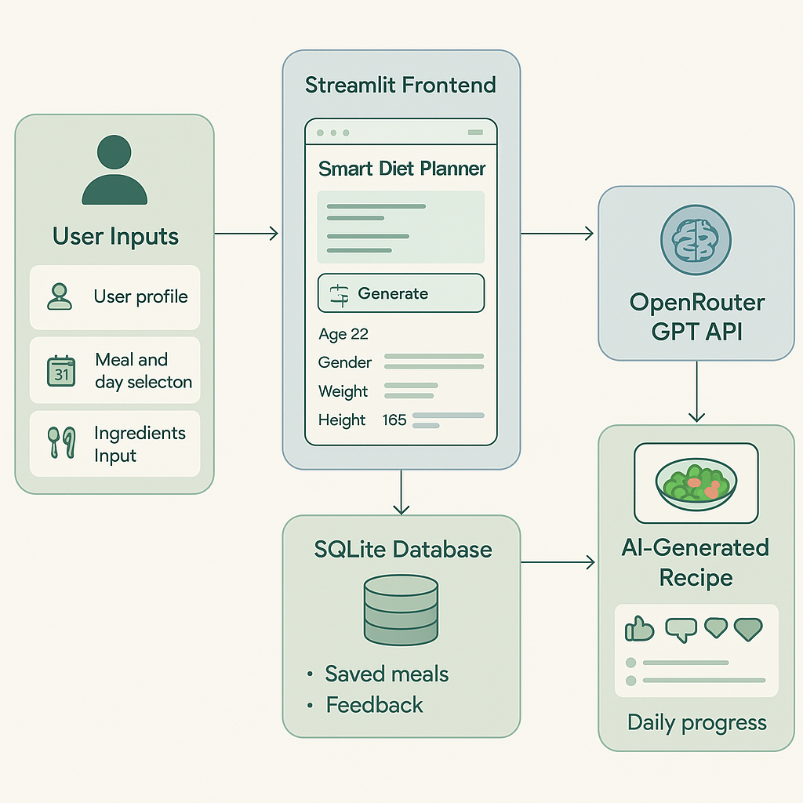

# 🥗 Smart Diet & Recipe Planner

**“Eat Smart, Live Better.”**

---

## 🚀 Project Overview

**Smart Diet Planner** is a personalized, AI-powered meal planning and recipe generator app. It helps users generate balanced meals tailored to their body type, goals, cuisine preferences, and available ingredients—while tracking daily feedback and meal history throughout the year.

---

## 🌟 Features Deep Dive

- 🧠 **AI-Powered Recipes**  
  Generate healthy and delicious recipes using OpenRouter (GPT-3.5) based on your ingredients and goals.

- 📅 **365-Day Meal Planner**  
  Choose any day of the year and track your meals across Breakfast, Lunch, Dinner, and Snacks.

- 🍱 **Time-Aware Smart Buttons**  
  App auto-suggests meals depending on the time of day (e.g., Breakfast in the morning, Dinner at night).

- 🧍‍♂️ **User Profile Personalization**  
  Enter age, gender, current/target weight, height, and cuisine preferences to receive personalized meals.

- 🗃️ **Cuisine-Based Suggestions**  
  Supports Indian, Global, Italian, Mediterranean, Keto, Vegan, South Indian, and more.

- ❤️ **Feedback Tracking**  
  After each recipe, users can mark if they had the meal, liked it, and give a rating. This data is stored with SQLite.

- 📊 **Daily Progress Summary**  
  Track your daily meal completion, preferences, and ratings with visual feedback.

---

## 🏗️ Technical Architecture



### Architecture Flow:
1. **User Inputs** (Profile Info, Meal Selection, Ingredients) →  
2. **Prompt Generated** →  
3. **Sent to OpenRouter API** →  
4. **Recipe Received (with meal name, ingredients, steps)** →  
5. **Displayed to User** →  
6. **Feedback Taken (had meal, liked, rating)** →  
7. **Data Saved in SQLite DB** →  
8. **Progress Rendered in Sidebar**

---

## 🛠️ Tech Stack

| Layer            | Technology         |
|------------------|--------------------|
| 🖥️ Frontend      | Streamlit (Python) |
| 🤖 AI Engine      | OpenRouter API (GPT-3.5) |
| 🗃️ Database       | SQLite             |
| 🛠️ Backend Logic | Python             |
| ☁️ Hosting       | Streamlit Cloud / Local |

---

## 📂 Repository Contents

- `diet_web_app.py` – Main Streamlit application file  
- `diet_feedback.db` – SQLite DB auto-created upon usage  
- `README.md` – This file  
- `A_flowchart_in_the_image_illustrates_the_architect.png` – Technical architecture image

---

## 📌 How to Run Locally

1. **Clone the repository:**
   ```bash
   git clone https://github.com/Aqsa-16/Smart-diet-planner.git
   cd Smart-diet-planner
